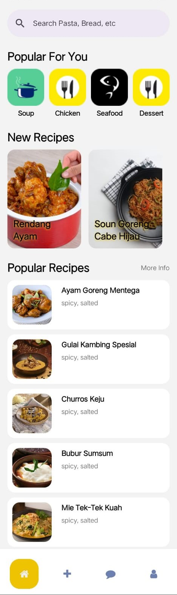
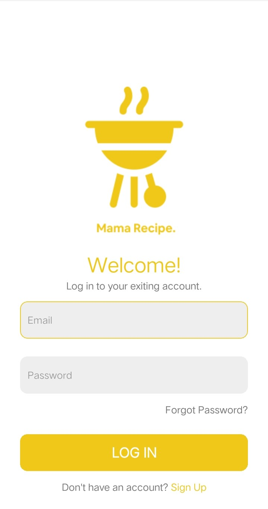
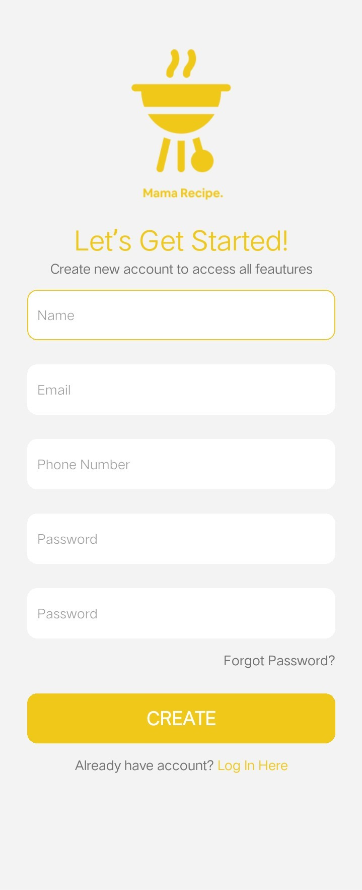
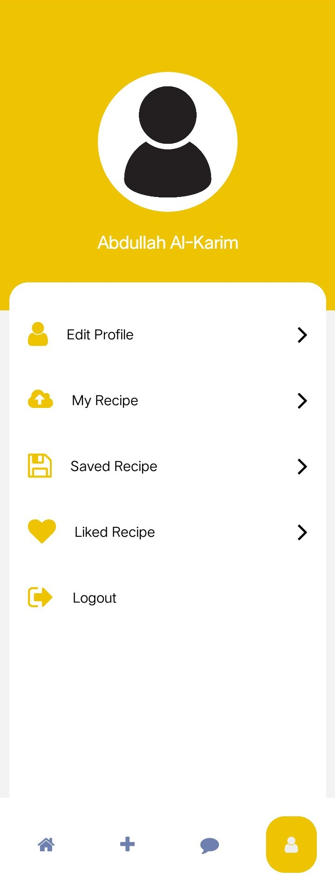
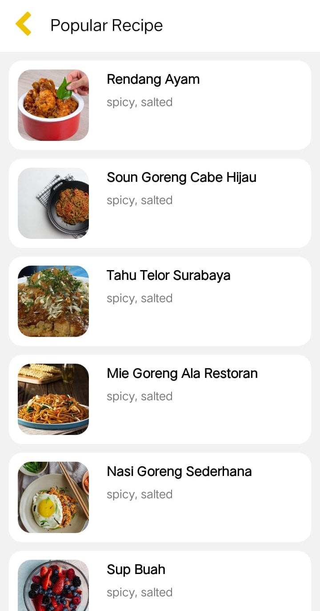
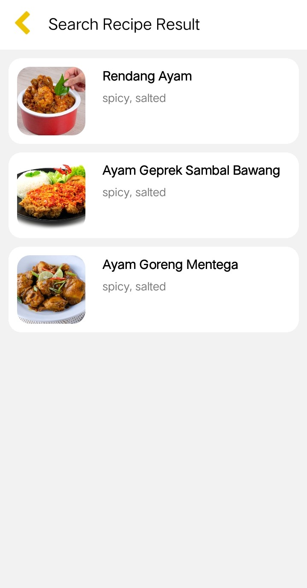
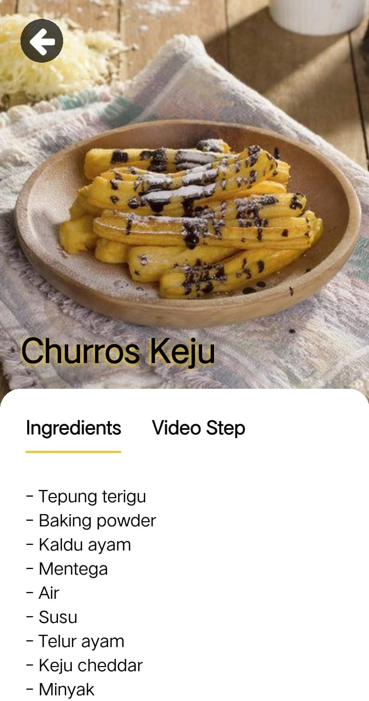
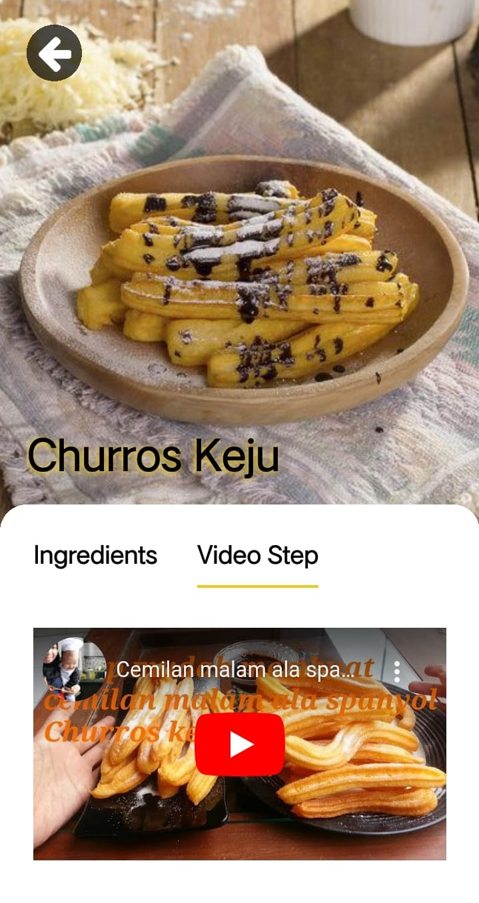
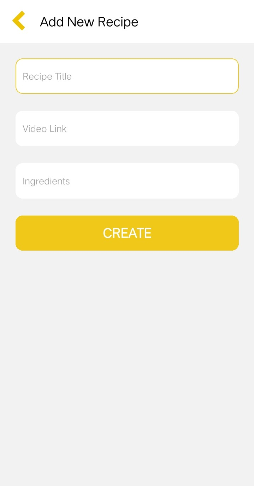
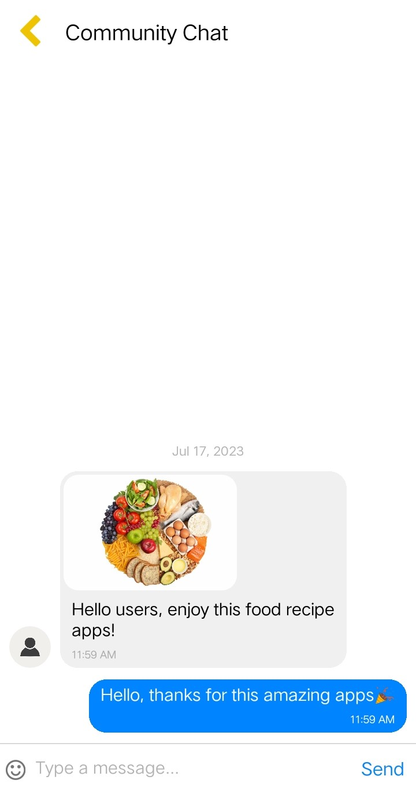

# Food Recipe Apps (Android)

Mobile based application for Food Recipe built with React Native, Redux Toolkit, Redux Persist, and Firebase Realtime Database.

  

Food Recipe Apps is an android apps that contains various recipes uploaded by users. In the recipe there is a description of the ingredients needed and cooking steps in the form of a video.

- Search for Recipes
- Screen for Add New Recipes
- Detail Recipes and Video Detail Recipes
- Screen for Authentication and Authorization

## Tech

Food Recipe Apps uses a number of open source projects to work properly:

- [React Native](https://reactnative.dev/) - mobile framework
- [Redux](https://redux.js.org/) - state management
- [Firebase Realtime Database](https://firebase.google.com/products/realtime-database) - realtime database

And of course Food Recipe Apps itself is open source with a [public repository](https://github.com/alkarim99/food-recipe-apps) on GitHub.

[Release APK](https://github.com/alkarim99/food-recipe-apps/releases) <br>
[Backend repository](https://github.com/alkarim99/food-recipe-be)

> **Note**: Make sure you have completed the [React Native - Environment Setup](https://reactnative.dev/docs/environment-setup) instructions till "Creating a new application" step, before proceeding.

## Installation

Food Recipe Apps able to run on your local, download this repo and open it using visual studio code, install your favorite emulator or use real android device, and run the terminal like below.

## Step 1: Start the Metro Server

First, you will need to start **Metro**, the JavaScript _bundler_ that ships _with_ React Native.

To start Metro, run the following command from the _root_ of your React Native project:

```bash
cd food-recipe-apps

# using npm
npm start
```

## Step 2: Start your Application

Let Metro Bundler run in its _own_ terminal. Open a _new_ terminal from the _root_ of your React Native project. Run the following command to start your _Android_ or _iOS_ app:

```bash
# type a to run on android
a
```

## Congratulations! :tada:

You've successfully run Food Recipe Apps. :partying_face:

## Screenshot

1. Home Screen <br>
   
2. Login Screen <br>
   
3. Register Screen <br>
   
4. Profile Screen <br>
   
5. Popular Recipe Screen <br>
   
6. Search Result Screen <br>
   
7. Detail Recipe Screen <br>
   
   
8. Add Recipe Screen <br>
   
9. Chat Screen <br>
   
